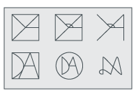

# xr86.github.io

### Assets (that are exported to site assets)

Some of the ideas from the process:  



### `.ai` to `site images` tutorial:
+ have layers for every icon type
+ cut .ai at a dimension convenient for the icon (artboard size) - eg: 600x600
+ use jsx  script to export for android and ios (separate)
+ for the other dimensions needed, use `save for web` and dimensions on layer names


### TODO
+ **make a script to make all these automated without extra steps**, rename files and move to folder, based on a config file
eg: 
```json
{
	"android": {
		"../images/android.png": "./android.png"
	}
}
```
